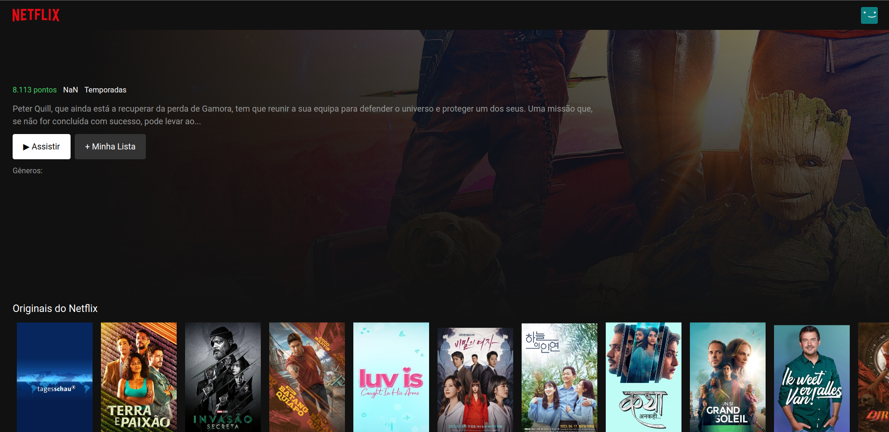

# Netflix-Clone
Netflix-Clone Preview (./src/assets/screenshot.png)


Um clone da página de entrada do Netflix, construído com React, JavaScript e Material-UI. Este projeto é inicializado com Vite, proporcionando uma configuração de desenvolvimento rápida e eficiente.

## Demonstração
Inclua um link ou GIF para uma demonstração ao vivo ou uma pré-visualização do seu projeto. Isso pode ser hospedado em qualquer plataforma (por exemplo, Netlify, Vercel ou GitHub Pages).

Veja uma demonstração ao vivo aqui

## Instalação
1.Certifique-se de ter o Node.js instalado.
2.Clone este repositório para o seu ambiente local usando:
  ```bash
  git clone https://github.com/VinicinBraga/Netflix-Clone.git

3.Acesse o diretório do projeto:
cd Netflix-Clone

4.Instale as dependências do projeto:
npm install

## Como usar

npm run dev

## Estrutura do Projeto

Netflix-Clone/
├── public/
│   ├── vite.svg
│   └── ...
├── src/
│   ├── api/
│   │   ├── FetchApi.js
│   ├── assets/
│   ├── components/
│   │   ├── FeatureMovie.js
│   │   ├── Footer.js
│   │   ├── Header.js
│   │   ├── Loading.js
│   │   ├── MovieRow.js
│   │   └── ...
│   ├── App.css
│   ├── App.jsx
│   └── ...
├── package.json
├── ...
└── README.md

## Contribuição
Contribuições são bem-vindas! Se você encontrar bugs, problemas ou tiver melhorias a serem sugeridas, abra uma issue ou envie uma solicitação de pull.

## Licença
Este projeto está licenciado sob a MIT License.

## Contato
Se você tiver alguma dúvida ou precisar entrar em contato, pode me encontrar em:

Email: vinicius@bragamatta.com ou vinibm85@gmail.com
GitHub: https://github.com/VinicinBraga
Linkedin: https://www.linkedin.com/in/vinícius-braga